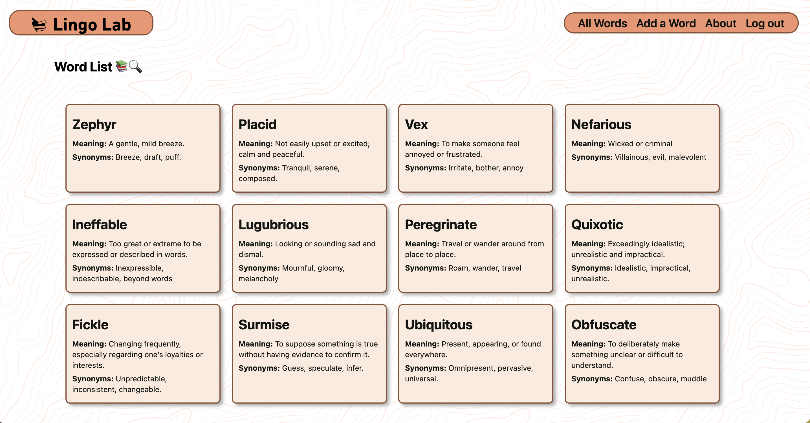

# **LingoLab**
**By: [Aditya Sharma](https://www.linkedin.com/in/aditya-sharma-3a0b6a190/)**

## Description

**[LingoLab](https://lingo-lab-fe3caee484ec.herokuapp.com/)**  is a vocabulary-building web app designed to help users expand their language skills by adding, managing, and organizing new words. It provides an intuitive interface to store words along with their meanings, synonyms, and usage in sentences.

**Features:**
* **User Authentication**: Sign up and log in to create a personalized word collection.
* **All Words Page**: View a complete list of words you've added along with their meanings.
* **Add Word**: Easily add new words with their meaning, synonyms, and example sentences.
* **Edit & Delete Words**: Update or remove words from your vocabulary collection.

With LingoLab, users can build and refine their vocabulary in an organized and efficient way.

## Getting Started

Click here to go to **[LingoLab](https://lingo-lab-fe3caee484ec.herokuapp.com/)** app

## Technology Used 

## Motivation

The idea for LingoLab came from my struggle to remember all the cool new words I encounter every day. Rather than jotting them down on random scraps of paper (or just forgetting them entirely), I decided to build an app that keeps them all in one place—so now my words are as organized as I hope my life will be... someday. 😉

## Attributions

* [Heroku](https://www.heroku.com/) For providing a platform that enabled the deployment and hosting of this app
* [Coolors](https://coolors.co/) for offering an excellent tool to generate vibrant color palettes!
* [Icons8](https://icons8.com/icons) for providing high quality logos!

